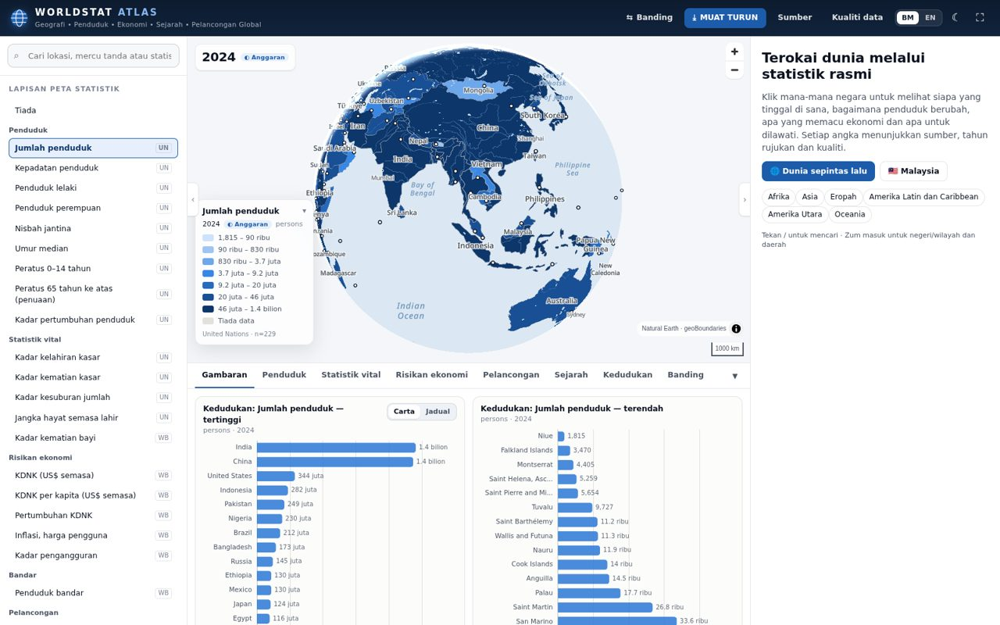
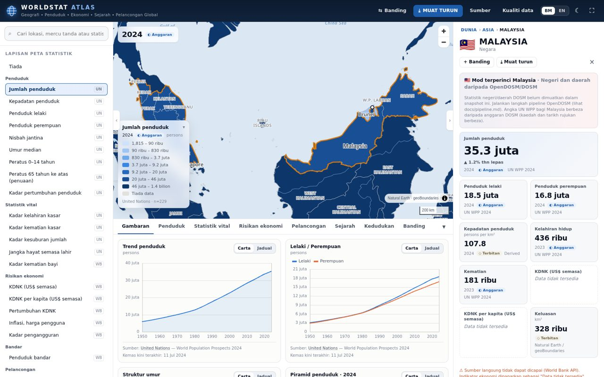
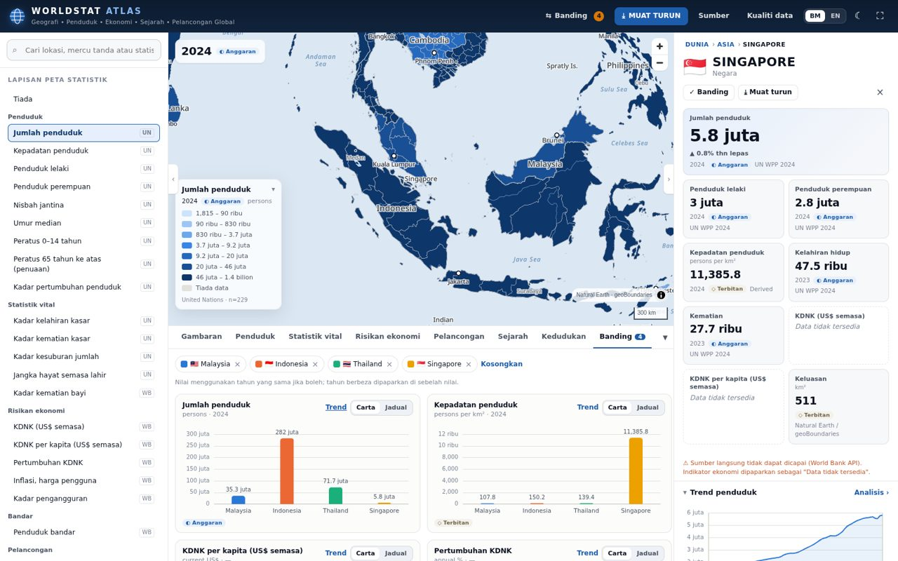
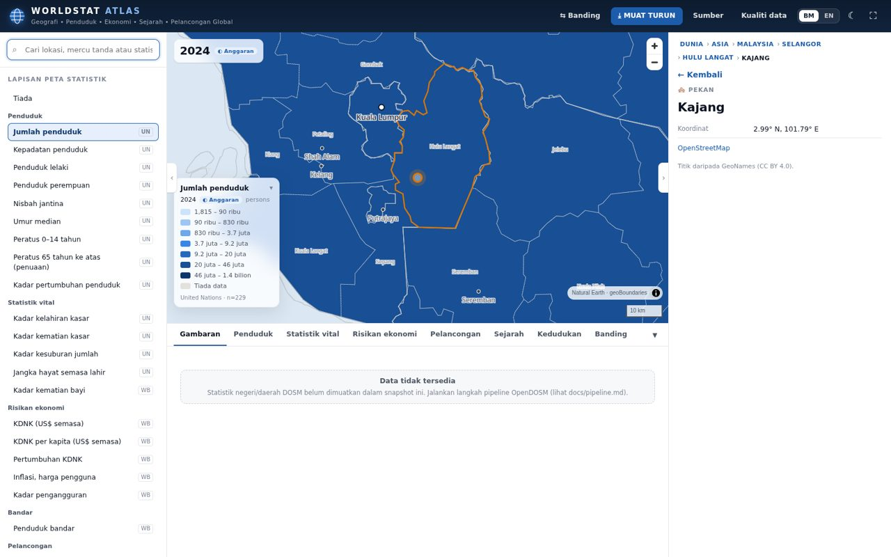
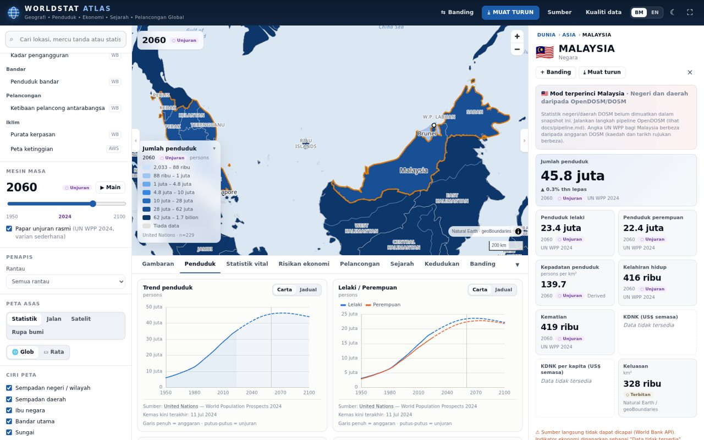
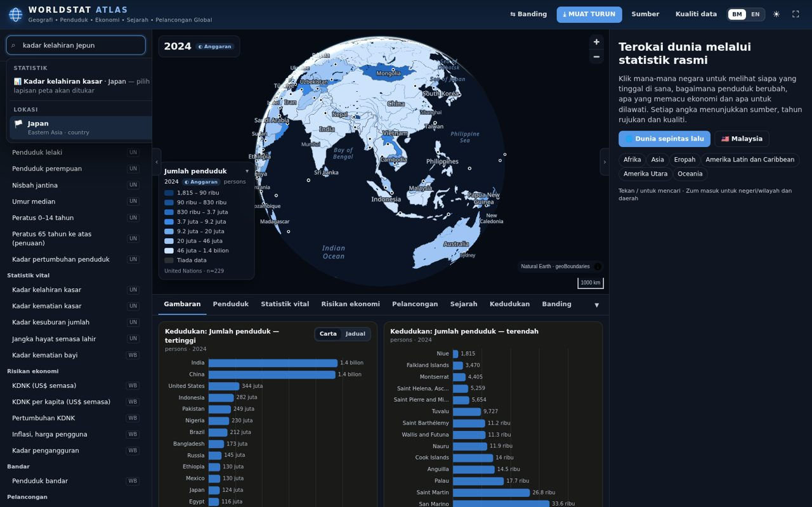

# WORLDSTAT ATLAS

**Global Geography • Population • Economy • History • Tourism Intelligence**

WorldStat Atlas ialah atlas statistik dunia digital yang interaktif: peta dunia sebagai *hero*, dengan
statistik rasmi (penduduk, statistik vital, ekonomi, pelancongan), profil geografi, mercu tanda dan
sejarah — bergerak dari **DUNIA → benua → negara → negeri/wilayah → daerah → bandar/pekan**.
Setiap angka memaparkan **sumber, tahun rujukan, kualiti (OFFICIAL / ESTIMATE / PROJECTION / DERIVED)
dan tarikh kemas kini**. Data yang tiada **tidak direka** — UI memaparkan *“Data tidak tersedia”*.

> Contoh laluan: `DUNIA › Asia › Malaysia › Selangor › Hulu Langat › Kajang`
> (`?geo=MY-10-hulu-langat`)



| Malaysia | Perbandingan | Kajang (breadcrumb penuh) |
|---|---|---|
|  |  |  |
| **Mod unjuran 2060** | **Mod gelap + carian pintar** | |
|  |  | |

---

## Ciri utama

| Modul | Apa yang ada | Sumber |
|---|---|---|
| Peta dunia interaktif | MapLibre GL (glob/rata), zum & pan lancar, klik negara/negeri/daerah, tooltip, breadcrumb, skrin penuh, LOD automatik ikut zum (1:110m → 1:50m → 1:10m, negeri dimuat malas per negara, daerah Malaysia) | Natural Earth, geoBoundaries |
| Lapisan peta | Statistik (vektor sendiri), Jalan, Satelit, Rupa bumi + peta ketinggian (hillshade + color-relief) | Esri, OpenTopoMap, AWS Terrain Tiles (boleh ditukar melalui `.env`) |
| Ciri peta | Sempadan negara/negeri/daerah, ibu negara, bandar, sungai, tasik, gunung, pulau & bentuk muka bumi, lautan, jalan utama, kawasan metropolitan, lapangan terbang, pelabuhan, mercu tanda | Natural Earth, Wikidata |
| Population Intelligence | Jumlah, lelaki, perempuan, nisbah jantina, kepadatan, keluasan, pertumbuhan, bandar/luar bandar, umur median, 0–14/15–64/65+, piramid penduduk interaktif, siri masa | UN WPP 2024, World Bank (WUP), DOSM |
| Statistik vital | Kelahiran, kematian, CBR, CDR, TFR, IMR, jangka hayat, pertambahan semula jadi, migrasi; perkahwinan (Malaysia, DOSM); perceraian → *Data tidak tersedia* (tiada siri rasmi terbuka) | UN WPP 2024, UN IGME via WB, DOSM |
| Economic Intelligence | KDNK, KDNK per kapita, pertumbuhan, inflasi, pengangguran, tenaga buruh, eksport/import, imbangan dagangan, struktur ekonomi (donut/treemap), tenaga, sewa mineral/minyak, pendapatan & kemiskinan | World Bank WDI (penyusun asal disimpan: ILO, IMF, UN Tourism…) |
| Geography Profile | Nama rasmi, jenis kawasan, hierarki, keluasan, koordinat, zon masa, puncak, sungai, tasik, pulau, laut berdekatan, bentuk muka bumi, iklim (kerpasan), sumber asli | Natural Earth (sambungan spatial), IANA, FAO via WB |
| Landmark & Tourism | 15 kategori (🏛️ 🏰 🕌 🌄 🏖️ 🏙️ 🎢 🏞️ 🏔️ 🏟️ ✈️ ⚓ 🎓 🏭), kad dengan gambar Commons berlesen, penerangan, koordinat, kepentingan, ringkasan Wikipedia | Wikidata (CC0), Wikimedia Commons, Wikipedia |
| History Explorer | Garis masa ikut era; peristiwa dipertikaikan ditanda dengan tafsiran berbeza dan rujukan; klik → lokasi di peta | Kurasi (Malaysia) dengan rujukan; Wikidata untuk negara lain |
| Statistical map layers | Penduduk, kepadatan, lelaki, perempuan, kelahiran, kematian, penuaan (65+), KDNK, KDNK per kapita, pengangguran, pembandaran, pelancongan, iklim (kerpasan), ketinggian — legenda choropleth dinamik (kuantil, palet tervalidasi CVD) | UN WPP, WB |
| Perbandingan | Sehingga 6 lokasi; tahun sepadan dipilih secara automatik, tahun berbeza ditanda jelas | semua |
| Time Machine | Slider 1950 → 2024 (anggaran) + mod unjuran rasmi hingga 2100, butang main | UN WPP 2024 |
| Parlimen (Malaysia) | Suis **Daerah ⇄ Parlimen**: 222 kawasan parlimen (P.001–P.222) di peta, carian (nama atau kod, cth. “P094”), breadcrumb dan panel; statistik DOSM — penduduk (2020–2024), pendapatan isi rumah & kemiskinan (2019, 2022, 2024); kampung dipautkan ke parlimen | DOSM (geodata + OpenDOSM) |
| Kampung & penempatan | Mod Malaysia: titik kampung/penempatan muncul pada zum ≥ 10, boleh dicari dan diklik; **tiada statistik peringkat kampung** — panel memaparkan statistik daerah (DOSM) dengan nota jelas | GeoNames (CC BY 4.0) |
| Smart Search | Lokasi, mercu tanda (Wikidata), dan statistik — “population Malaysia”, “kadar kelahiran Jepun”, “Mount Fuji” | indeks sendiri + GeoNames + Wikidata |
| Download Center | CSV, Excel, JSON, GeoJSON, PNG, PDF — hanya kawasan dipilih; setiap rekod: lokasi, indikator, nilai, unit, tahun rujukan, kualiti, sumber, URL sumber, kemas kini terakhir, nota metodologi | — |
| Data Quality Engine | missing values, duplicate records, outliers, year mismatch, geographic mismatch, unit mismatch (pipeline + runtime) | — |
| Mod Malaysia | Negeri (16) dan daerah (159 poligon) dengan statistik OpenDOSM/DOSM diutamakan; perbandingan DOSM ↔ UN WPP | DOSM, geoBoundaries |
| Tema | Mod Cerah & Gelap, BM/EN | — |

## Mula cepat

```bash
npm install            # Node ≥ 20
npm run dev            # http://localhost:5173 — guna snapshot dalam public/data
npm test               # ujian unit (enjin kualiti, carian pintar, eksport)
npm run build          # build produksi ke dist/
```

Aplikasi berfungsi **tanpa backend**: snapshot statik `public/data` (dijana oleh pipeline) dihidangkan
terus. World Bank, Wikidata dan Wikipedia dipanggil **secara langsung** dari pelayar (dengan cache
sesi 6 jam); jika sumber tidak dapat dicapai, UI memaparkan *“Data tidak tersedia”* dan sebabnya.

### Menjana semula data (pipeline)

```bash
pip install -r scripts/pipeline/requirements.txt
npm install --prefix scripts/pipeline
python3 scripts/pipeline/run.py                 # penuh (langkah rangkaian gagal dengan selamat)
python3 scripts/pipeline/run.py --skip-network  # luar talian
```

Lihat [`docs/pipeline.md`](docs/pipeline.md). Snapshot semasa (4 Okt 2026) mengandungi UN WPP 2024,
World Bank WDI, statistik nasional/negeri/daerah OpenDOSM, dan mercu tanda Wikidata bagi **Malaysia dan
Peru sahaja** — Wikidata Query Service sedang menghadkan kadar kepada 1 permintaan/minit (gangguan
servis), jadi negara lain dimuat secara langsung dari pelayar. Untuk melengkapkannya kemudian:
`python3 scripts/pipeline/run.py --only wikidata publish` (langkah ini meneruskan negara seterusnya
jika satu negara gagal, dan berhenti selepas 5 kegagalan berturut-turut).

### Supabase (PostgreSQL + PostGIS) — pilihan

```bash
supabase db push                                   # migrasi dalam supabase/migrations
psql "$SUPABASE_DB_URL" -v ON_ERROR_STOP=1 -f scripts/supabase/load_exports.sql
```

Lihat [`docs/supabase.md`](docs/supabase.md). **Jangan commit** kunci `service_role` atau rahsia API.
Pelayar hanya menggunakan kunci *anon/publishable* (baca sahaja melalui RLS).

## Struktur repositori

```
src/
  components/     UI (Header, Sidebar, SearchBox, TimeMachine, Legend, Dashboard, ComparePanel, DownloadModal, panel/*)
  maps/           MapView (MapLibre), lapisan, palet choropleth, peta asas
  charts/         ECharts (trend, piramid, kedudukan, donut, treemap, perbandingan) + ChartCard (paparan jadual)
  pages/          Sumber & asal usul, laporan kualiti data
  services/       catalog, geo, stats, worldbank, wikidata, search, export, supabase, http
  hooks/          useLayer, useLocation, resolve (keutamaan sumber)
  utils/          i18n (BM/EN), format, quality (enjin kualiti runtime), geoRefs
  types/          jenis domain
  store/          keadaan aplikasi (zustand)
data/
  registry/       sources.json, indicators.json, landmark_categories.json, mys_district_crosswalk.json
  curated/        sejarah kurasi (dengan rujukan)
  logs/           log import (jsonl, tidak di-commit)
scripts/
  pipeline/       pipeline Python (+ alat Node: mapshaper, rujukan)
  supabase/       load_exports.sql
supabase/
  migrations/     skema, fungsi RPC/MVT, RLS, materialized views
  functions/      edge function data-proxy
public/data/      snapshot statik (dijana — jangan sunting dengan tangan)
docs/             seni bina, kamus data, sumber, pipeline, Supabase, deployment, kualiti data
```

## Dokumentasi

- [Seni bina](docs/architecture.md)
- [Kamus data](docs/data-dictionary.md)
- [Sumber data & lesen](docs/data-sources.md)
- [Pipeline data](docs/pipeline.md)
- [Enjin kualiti data](docs/data-quality.md)
- [Supabase / PostGIS](docs/supabase.md)
- [Deployment](docs/deployment.md)

## Batasan yang perlu diketahui (jujur)

1. **Angka UN WPP bagi Malaysia berbeza daripada DOSM** (cth. UN: 35.3 juta pada 1 Jan 2024; DOSM
   menerbitkan anggaran pertengahan tahun yang lebih rendah). Ini perbezaan kaedah, bukan ralat. Mod
   Malaysia mengutamakan DOSM apabila snapshot DOSM dimuatkan; UN kekal untuk perbandingan antarabangsa.
   **Daerah:** poligon geoBoundaries mendahului beberapa pemecahan daerah (Sarawak: Gedong, Lingga, Pantu,
   Sebuyau, Siburan; Sabah: Membakut) dan tiada poligon Putrajaya. Daerah ini tidak dipaparkan di peta
   (direkod sebagai *geographic mismatch*), dan daerah induknya mungkin dilukis lebih besar daripada
   kawasan yang diwakili angka DOSM — kepadatan terbitan bagi daerah tersebut perlu dibaca dengan berhati-hati.
2. **Statistik negeri/daerah di luar Malaysia** tidak tersedia secara harmoni dalam sumber terbuka →
   *Data tidak tersedia*.
3. **Perceraian** dan **perkahwinan global** tiada siri rasmi terbuka yang boleh dibaca mesin.
4. **Iklim**: hanya purata kerpasan (FAO via WB); klasifikasi Köppen tidak dimuatkan.
5. **Puncak/sungai** dalam profil geografi ialah ciri yang tersenarai dalam Natural Earth sahaja.
   **Keluasan geometri** (dan kepadatan terbitan) boleh tersasar bagi negara kecil/pulau — cth.
   Singapura 511 km² dalam Natural Earth 1:10m berbanding ~735 km² rasmi. Apabila data World Bank
   tersedia, panel menggunakan kepadatan rasmi berasaskan keluasan tanah FAO (`EN.POP.DNST`).
6. **Sempadan** mengikut pandangan lalai Natural Earth (*de facto*), bukan pengesahan mana-mana tuntutan.
7. Jubin peta asas pihak ketiga (Esri, OpenTopoMap) tertakluk kepada terma masing-masing;
   tukar kepada akaun berlesen untuk produksi (`VITE_BASEMAP_*`).
8. Belum ada pengesahan bahawa API World Bank / OpenDOSM / Wikidata membenarkan CORS dari domain
   anda; jika tidak, aktifkan edge function `data-proxy`.

## Lesen

Kod: belum ditetapkan oleh pemilik repositori (`UNLICENSED`). Data: mengikut lesen setiap sumber
(lihat [`docs/data-sources.md`](docs/data-sources.md)) — kebanyakannya CC BY, CC0 atau domain awam;
atribusi wajib dipaparkan (aplikasi melakukannya secara automatik).
